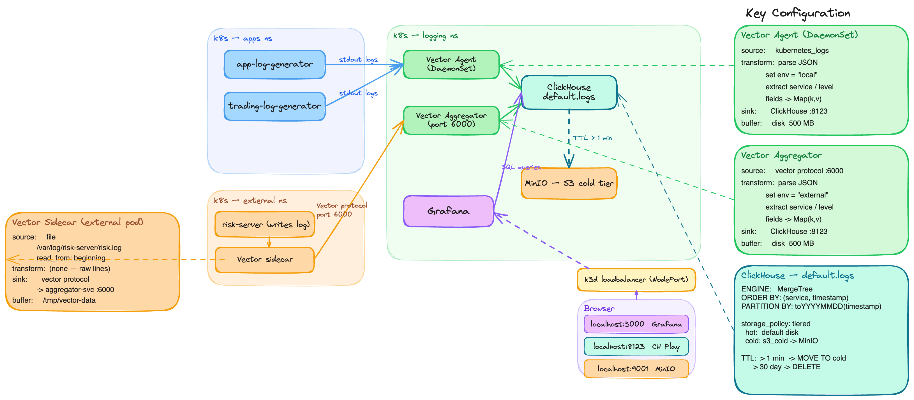

# Ematiq Logging PoC

Kubernetes-based logging PoC for Ematiq, running locally on **k3d**.

## Architecture



> Full diagram also on [Excalidraw](https://excalidraw.com/#json=bclp_jMEWDbeEi77cdBle,yFUW3aoBWhxyFn6Lr8I9ig)

## Stack

| Component | Role |
|-----------|------|
| **ClickHouse** | Log storage with tiered hot/cold storage |
| **ClickHouse Keeper** | Coordination (ZooKeeper replacement) |
| **MinIO** | S3-compatible cold tier (via ClickHouse TTL) |
| **Vector Agent** | DaemonSet — collects k8s pod logs |
| **Vector Aggregator** | Receives logs from external servers |
| **Grafana** | Dashboards + ClickHouse datasource |

## Prerequisites

The following tools must be installed and available on `PATH`:

| Tool | Purpose | Install |
|------|---------|---------|
| [Docker Desktop](https://www.docker.com/products/docker-desktop/) | Container runtime for k3d | docker.com |
| [k3d](https://k3d.io) v5+ | Local Kubernetes via Docker | `brew install k3d` |
| [kubectl](https://kubernetes.io/docs/tasks/tools/) | Kubernetes CLI | `brew install kubectl` |
| [Helm](https://helm.sh) v3+ | Deploys Vector + Grafana | `brew install helm` |

**Resource requirements:** Docker Desktop should have at least **6 GB RAM** and **4 CPUs** allocated (Settings → Resources).

## Quick Start

```bash
cd poc
./setup.sh
```

The script is idempotent — safe to re-run.

## Access

| Service | URL | Credentials |
|---------|-----|-------------|
| Grafana | http://localhost:3000 | admin / admin |
| ClickHouse | http://localhost:8123/play | — |
| MinIO Console | http://localhost:9001 | minioadmin / minioadmin |

## Persistence

After a reboot:
1. Docker auto-starts (enable "Start at Login" in Docker Desktop settings)
2. k3d containers restart automatically (`restart=unless-stopped` policy)
3. Wait ~2 min, then all URLs above are available

No need to re-run `setup.sh` after a normal restart.

## Demo Queries

See [`poc/demo-queries.sql`](poc/demo-queries.sql) — run at http://localhost:8123/play.

Covers:
1. All log sources ingesting
2. Live volume per minute
3. p99 order execution latency by symbol
4. Risk check failure rate by symbol
5. Portfolio risk breaches (external source)
6. Cross-fleet error grep
7. Hot vs cold storage distribution
